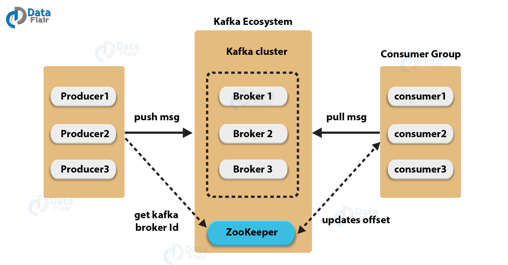

# KAFKA

## KafKa란
소셜 네트워크 서비스 기업인 **[LinkedIn](https://www.linkedin.com/)** 에서 개발한 플랫폼으로, `대용량, 대규모 메시지 데이터를 빠르게 처리할 수 있다는 장점`을 가지고 있다.

RabbitMQ, ZeroMQ, AMQP등과 마찬가지로 Message Queue 서비스에 속하지만, 
KafKa는 단순한 하나의 어플리케이션이 아닌, `하나의 통합메세지 전송 서버`로서의 역할을 한다.

**기존 End-to-End 연결방식의 문제점**
1. 각 서버 및 시스템(End) 별 실시간 및 비동기처리가 이루어지는데, 통합된 데이터 전송영역이 없으니 복잡도가 증가
2. RDB, NoSQL, Hadoop, Redis 등 각기 다른 DB를 통해 동일한 데이터를 서로만의 Pipeline으로 관리한다면, 통합 데이터 분석 시 서로 연결점을 찾기 힘들다
    - 각자 요구하는 Format이 다르기에 데이터 통합관리에 어려움을 겪는다는 것.

이를 해결하기 위해 만들어진 것이 Kafka

개발 당시 중점적으로 이루어진 것은
1. Producer와 Consumer의 분리
2. 메시징 시스템과 같이 영구 메시지 데이터를 여러 컨슈머에게 허용 및 전송
3. 높은 처리량을 위한 메시지 최적화
4. 자유로운 Scale Out이 가능하도록 하자

## Message Queue
메세지 큐, 일명 MQ라 하는 메세지 큐 시스템은 `메세지`라 부르는 데이터 단위를 `Producer`/`Publisher`라는 전송자가 데이터를 MQ 서버의 지정된 `Topic`에 보내면 `Consumer`/`Subscriber`라는 수신자는 원하는 토픽에서 데이터를 가져가면 된다.

이렇게 MQ 서버를 사이에 두고 비동기적으로 메세지를 주고 받는 일련의 통신을 Pub/Sub 모델이라 한다.

### MQ의 장/단점
1. 메세지 시스템의 안정성이 보장된다면 전달되어야 하는 메세지는 절대 유실되지 않는다.
2. 각 개체가 서로 연결되어 있지 않기에 확장성이 용이하다.
3. Publisher/Subscriber가 서로 영향을 주지 않는다.
4. 메세지 전달이 목표인 시스템이기에 전달 속도가 빠르지는 않다.
5. 서버 자체가 보안적으로 위험해지거나 안정성이 떨어지면 모든 시스템에 영향을 줄 수 있다.

## KafKa Architecture

※ This photo aws taken from 'https://data-flair.training'

### KafKa 메세지 전달순서
1. Publisher는 KafKa에 새로운 메세지를 보낸다.
2. Publisher가 보낸 메세지는 KafKa의 특정 Topic에 저장된다.
3. Subscriber는 KafKa에 주기적으로 접속하여 새로운 데이터를 가져간다.

## KafKa만의 특징
### 1. Producer와 Consumer의 분리
기업에서 운영중인 서비스가 확장되어 다양한 서버들이 증가하고, 서버 간 연계되는 데이터 종류가 증가한다고 하자.

처음은 쉽게 이해할 수 있는 연결고리이겠지만, 수 십, 수 백대 서버로 발전한다면 이를 모두 이해할 수 있는 개발자가 있을까?

이 때 Producer와 Consumer를 구분하여 데이터를 생성하는 서버, 데이터를 수집/모으는 서버로 나누어진다면 더 이상 복잡한 연결고리를 이해할 필요가 없어진다.
******
### 2. Multi작업이 가능
Producer는 하나의 데이터를 2개 이상의 Topic에 보낼 수 있으며 하나의 Topic은 2개 이상의 서버로부터 데이터를 받을 수 있다.

마찬가지로, Consumer는 2개 이상의 Topic으로부터 데이터를 가져올 수 있고 하나의 Topic로부터 2개 이상의 Consumer가 데이터를 가져갈 수 있다.
*****
### 3. Write on Hard Disk
여타 기존의 MQ와는 달리 KafKa는 디스크에 메세지를 저장하고 보존하는 특성을 가진다.
Consumer가 데이터를 읽으면서 Queue에서 삭제(보통 Pop)하지 않기에 일시적 오류 또는 네트워크 문제, 일시적 폭주로 인한 Overflow에도 유실되지 않도록 할 수 있다.
*****
### 4. 확장성
KafKa는 Broker(KafKa가 설치되어있는 서버 or 노드)라는 개념을 두어 확장을 매우 용이하도록 한다. 또한 클러스터 구성이 가능하여 기존 KafKa 서버중단 없이 확장이 가능하다.
*****
### 5. High Performance
카프카는 고성능(하루에 1Peta)을 목표로 한 Message Queue Application. 이를 실현하기 위해 내부적으로 분산처리, Clustering 등 다양한 기법을 사용한다.

## Kafka 주요용어 정리
1. Broker
    - KafKa 어플리케이션이 설치되어 있는 서버 또는 노드를 의미
2. Topic
    - Producer와 Consumer가 자신들의 메세지를 주고 받을 때 구분할 수 있도록 지정한 Queue 이름. Topic이라는 개념을 통해 각자의 데이터를 구분한다.
3. Partition
    - 병렬처리가 가능하도록 토빅을 나눌 수 있고 많은 양의 메세지 처리를 위해 나눈 물리적 Disk 분리. 디스크 Partition과 같은 의미

 
 
 
 
All images on this page will be used for personal study, not commercial use.