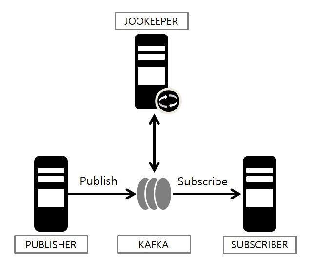

# 1. ZooKeeper
## 주키퍼
- 분산 Application을 위한 코디네이션 시스템.
- 분산되어 있는 각 Application의 정보를 중앙에 집중하고 구성 관리, 그룹 관리, 동기화 등의 서비스를 제공하는 `코디네이션 Application`
- 주키퍼는 모든 내용을 Memory에 저장하기에 처리량이 매우 빠르고 크다.
- 과반수 시스템?을 사용하여 살아있는 노드 수가 과반수 이상이라면 지속적인 서비스가 가능하다.
- 과반수 방식을 채택하기 때문에 홀수 개의 서버로 구성해야 한다.

## 주키퍼와 카프카 통신

→ 주키퍼는 Kafka와 직접 통신을 하며 오프셋관리, 메타데이터 저장, Kafka Application 상태관리 등을 도와준다.

Kafka의 각 분산된 Application들은 클러스터 형태로 구성된 주키퍼 서버들과 커넥션을 맺는다.

Kafka의 상태 정보는 z-node라 불리는 곳에 Key/Value 형태로 저장하고 이 값들을 이용하여 분산 Application들은 서로 데이터를 주고받게 된다.

### Z-NODE
Z-node
- 주키퍼에서 사용되는 Z-node는 `데이터를 저장하기 위한 공간`을 부르는 이름으로 일반 컴퓨터의 파일/폴더 개념과 유사하며 일반적인 폴더와 마찬가지로 계층형(Hierarchical) 구조로 이루어져 있다.

주키퍼의 각 z-node는 데이터 변경 등에 대한 유효성 검사 등을 위해 버전관리를 하며 z-node 데이터가 변경 시 Version 번호가 증가하는 형태이다.

# 2. Jookeeper & Kafka 설치 및 구성
## JOOKEEPER 설치
### 1. Download
[주키퍼 공식홈페이지](https:/zookeeper.apache.org)에서 tar.gz 파일 다운로드

### 2. 설치
원하는 Directory에 압축풀기

※ 주키퍼는 Z-node 복사본 SnapShot과 Transaction Log를 저장하는 별도의 Directory를 만들어둔다. 
- Log를 저장하다가 어느정도 시점이 다다르면(로그 크기) SnapShot을 저장한다.
- 중요한 Directory이기에 설치파일과 별도의 경로로 지정하는것을 권장.

### 3. Configuration
**1. Node ID 구분**
- myid라는 파일을 생성하여 각 node의 ID를 설정
- 해당 파일 안에는 정수값만 들어가야 한다.

**2. 환경파일(zoo.cfg) 설정**
- tickTime
    - 주키퍼가 사용하는 시간에 대한 기본 측정 단위
- initLimit
    - Follow Server가 Leader Server와 초기에 연결하는 시간에 대한 TIMEOUT Tick의 수
- syncLimit
    - Follow Server가 Leader Server와 동기화하는 시간에 대한 TIMEOUT Tick의 수(주키퍼 데이터가 커질수록 늘려야 함)
- dataDir
    - 위에서 언급한, SnapShot과 Transaction Log를 저장하는 별도 Directory 경로 
- clientPort
    - 주키퍼 사용 TCP PORT
- server.x
    - 주키퍼 Cluster 구성을 위한 서버 간의 설정
    - server.myid 형식으로 사용
    - > server.1=peter-zk001:2888:3888
    - 2888, 3888은 Default 포트. Cluster구성 및 Leader Server 결정에 사용 

### 4. 실행 및 중지
- 시작 명령어
    - > <zookeeper_default>/bin/zkServer.sh start
- 종료 명령어
    - > <zookeeper_default>/bin/zkServer.sh stop

※ (전체 설정 정보는 공식 홈페이지에서)

## KAFKA 설치
주키퍼와 달리 자유롭게 서버를 구성 가능

주키퍼의 Coordination 기능을 충분히 활용하기 위해 주키퍼와 카프카는 별도의 서버로 구성해야 한다.

### 1. Download
[카프카 공식홈페이지](https:/kafka.apache.org/downloads)에서 tar.gz 파일 다운로드

### 2. 설치
Kafka는 Scala를 사용하므로 미리 설치 필요
압축파일 풀어 사용자 지정 Directory에 설치

### 3. Configuration
Kafka는 다른 MQ Service와는 달리 Consumer가 Message를 가져가더라도 저장된 데이터를 임시로 저장하기에 별도의 저장 Directory를 준비해야 한다. 

이 때, 디스크가 여러 개인 서버의 경우 각 디스크 수만큼 Directory를 만들어준다면 I/O를 그 수만큼 분산할 수 있다.

주의할 점은, Directory의 이름을 `각 서버 모두 동일`하게 지정해야 한다는 점!

**1. Node ID 구분**
- Zookeeper와 마찬가지로 각 카프카 Host의 이름을 myid라는 파일로 설정

2. Configuration
- broker.id : 브로커를 구분하기 위한 ID [NUMBERS]
- delete.topic.enable : Topic 삭제가능 여부
- auto.create.topics.enable : 존재하지 않는 Topic으로 메세지를 전송했을 경우 자동으로 토픽 생성
- log.dirs : Log파일 저장위치 설정
- num.partitions : Partitions 갯수 기본 값
- message.max.bytes : Kafka에서 허용하는 가장 큰 Message 크기
- zookeeper.connect : 주키퍼 접속 정보
    - `주키퍼 정보를 입력 시, 주키퍼 앙상블 서버리스트를 전부 입력해야 한다.`
    - 일부만 입력할 시 그 일부가 다운됐을 때 카프카 Application은 동기화되지 않고 같이 다운되어 서비스에 차질이 생기기 때문
- log.flush.interval.ms : 메세지가 디스크로 Flush되기 전 메모리에서 유지하는 시간

※ 세부설정사항은 공식홈페이지 Docs / Github에서 확인 가능

### 4. 실행 및 중지
- 실행
    - > <kafka_basedir>/bin/kafka-server-start.sh <kafka_basedir>/config/server.properties
    - 백그라운드에서 실행하기 위해서는 뒤에 `-daemon` 옵션 추가

- 중지
    - > <kafka_basedir>/bin/kafka-server-stop.sh

### 5. Kafka 상태 확인
기본적으로 <pre>
ps -ef | grep '~'
</pre> 등의 명령어로 체크하거나 systemd로 등록한 경우 `systemctl` 명령어로 status를 확인하는 방법이 있으나 그 외 카프카&주키퍼 연결상태 혹은 로그 등을 확인하는 방법이 있다.

**1. TCP PORT 확인**
- 주키퍼의 Default Port : 2181
- 카프카의 Default Port : 9092
- > netstat -ntlp | grep [PORT]
    - 정상적으로 열려있고 Listen 상태인지 확인

**2. 주키퍼 Z-NODE를 이용한 카프카 Application 상태 확인**
- <zookeeper_baseDir>/bin/zkCli.sh 를 통해 주키퍼 CLI로 접속 가능
    - `ls` 명령어를 통해 Z-NODE 존재여부를 알 수 있고, 하위정보르 Kafka Broker ID를 찾을 수 있다면 정상적으로 연결되어있다는 의미.

**3. Kafka Log 확인**
- 카프카 실행 후 Log 파일을 통해 설정정보 및 현재 상태를 확인할 수 있다.
    - <kafka_baseDir>/log/server.log
    - Kafka Config 내용, 주키퍼 설정 및 연결내용 등 파악 가능