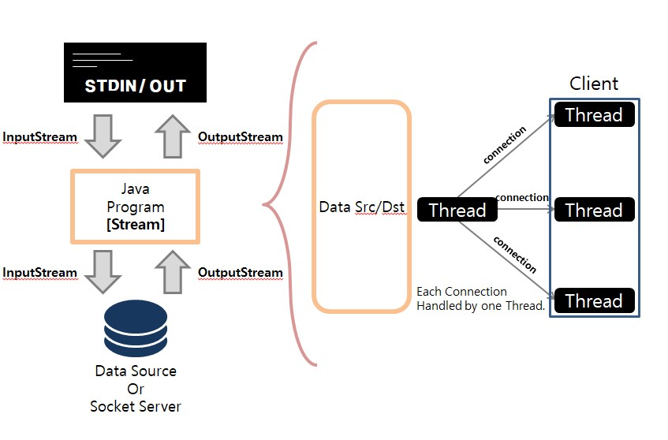
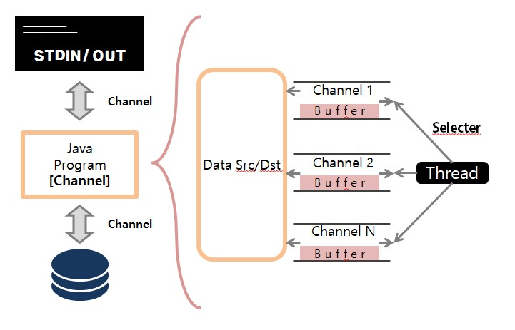

# JAVA NIO
NIO : `New Input Output`이라는 이름으로 Java 4부터 기본 패키지에 포함된 API.

## NIO 등장 배경
### JAVA는 느리다!
이 말은 프로그래밍을 배운 사람이라면 한번 쯤은 들어본 말이다.

이유는 크게 4개 정도로 볼 수 있다
1. C/C++ 처럼 Memory를 직접 관리할 수 없다.
2. System Call을 직접 사용할 수 없다.
3. JVM이라는 추상적 공간을 띄운 뒤 그 안에서 실행된다.
4. GC(Garbage Collection)관리로 메모리가 요구된다.

**여기서!** Java I/O가 특별히 성능 면에서 부족한 면이 많은데 이와 연관성이 깊은 이유는  <U>`1. Memory 직접 접근/관리 불가`</U> 와 2. <U>`System Call 직접 사용 불가`</U> 이다.

이를 개선하고자 새로 만들어진 API가 `NIO` 패키지인 것이다.

### 기존 I/O의 비효율성
Java I/O Process
1. Application Process가 Kernel에 `파일 Read 명령`을 전달한다.
2. Kernel에서 System Call을 통해 Disk로부터 File 데이터를 가져와 `Kernel Buffer에 넣는다`. (DMA 관여)
3. Kernel Buffer에 모두 넣어지면 이를 `다시 Process Buffer에 복사`한다.
4. Process는 해당 Buffer 내용을 가지고 데이터처리를 시작한다.

이 프로세스를 보면, 왜 자바의 I/O가 특히 느린지를 알 수 있다. 
**Kernel Buffer -> Application Buffer** 이 부분, 프로세스가 커널의 Buffer를 직접 접근할 수 없어 굳이 한번 더 복사를 해야하는 한계가 존재한다.

이를 해결할 수 있다면 어떨까.

커널 영역의 Buffer를 직접 접근할 수 있다면 굳이 Buffer 복사를 위해 CPU 자원, GC 관리자원을 쓸 이유가 없다.

이를 고려하여 `새로이 만든 I/O 패키지가 NIO` 인 것이다.

## IO vs NIO

### 비교
| 구분       | IO             | NIO                         |
| :--------- | :------------ | :--------------------------- |
| 입출력 방식| Steam         | Channel                      |
| 버퍼 방식  | Non-Buffer    | Buffer Oriented              |
| 비동기 지원| 지원 안함     | 지원                         |
| 블로킹 방식| Only Blocking | Both Blocking / Non-Blocking |

#### JAVA IO Communication

#### JAVA NIO Communication

### Stream vs Channel
- **Stream**
    - Stream은 InputStream과 OutputStream으로 구분되어 있어 데이터 Read/Write 할 시 각각 Stream을 만들어주어야 함
- **Channel**
    - Channel은 양방향 입출력 가능. 하나의 Channel로 Read/Write 가능

### Non-Buffer vs Buffer
- **Non-Buffer**
    - IO는 OutputStream이 1Byte를 쓰면 InputStream 또한 1Byte를 읽는다.
    - Stream에서 읽은 데이터를 즉시 처리하므로 Stream에서 입력된 전체 데이터를 별도로 저장하지 않으면 데이터 처리에 제약이 발생
- **Buffer**
    - NIO는 읽은 데이터를 무조건 Buffer에 저장.
    - 데이터 처리에 자유로움
    - CPU 과부하를 막을 수 있다.
        - CPU System Call은 데이터를 한 번 옮길 때마다 자원이 소비된다.
        - 이 말은 즉, 글자 1개로 된 객체를 옮기든 글자 1000개로 된 객체를 옮기든 1번의 System Call을 부른다는 것.
        - 그렇다면 우리는 파일을 읽을 때 어떤 방식으로 System Call을 사용해야 하겠는가?

### Blocking vs Non-Blocking
- **Blocking**
    - IO의 Stream 방식은 Blocking만을 지원한다.
    - Thread가 Read 혹은 Write 명령어를 실행하는 동안 Blocking되며, 해당 명령어가 실행되는 동안 Thread는 다른 동작이 불가능하다.
    - I/O 작업시간이 길어질수록 해당 Thread를 그 시간만큼 못쓴다는 것.
    - `Socket 통신할 시, I/O 전용 Thread로 지정할 수 있다는(다른 작업에 방해받지 않는다는) 장점이 존재`
- **Non-Blocking**
    - NIO Channel 방식은 Blocking / Non-Blocking 모두 지원 가능하다.
    - Non-Blocking은 I/O 작업 Ready가 완료된 Channel만 선택하여 Thread가 처리하므로 Blocking 되지 않을 수 있다.
    - `과도한 Thread 생성을 피하고 재사용성이 증가한다는 장점이 존재`
    - 여기서 **SELECTOR**라는 멀티플렉서 개념이 등장한다.

## NIO 특성
**NIO의 Keyword는 총 3가지**
1. Buffer
- Java의 Pointer Buffer(nio 패키지에서 제공하는 Buffer 클래스)

2. Channel
- read / write 모두 가능한 양방향식 입출력 Class
- Native IO, Scatter/Gather 모델 형식으로 효율적인 I/O 처리(System Call 줄이기, 모아서 처리하기)

3. Selector
- Network 통신 효율을 높이기 위한 Multiplexer
- 하나의 Thread로 여러 Connection을 다룰 수 있도록 하는 Reactor 패턴 구현체
- Selector 사용으로 Thread 과부하 및 성능 저하를 막을 수 있다.

## NIO 관련 주목해야 할 OS 기술
### Scatter / Gather
위에서 언급한 것과 같이 객체 한 개를 옮기는데 System Call 한 번이 사용된다.

System Call은 CPU 자원을 사용하는 것과 같은 일이므로 마구잡이로 사용할 것이 아니다(SW 성능이 크게 좌지우지 되는 요건)

Scatter / Gather 모델방식을 사용하여 Application에서 사용하는 Buffer 목록을 한 번에 넘겨(System Call 한 번 만으로) 자원소모를 줄이는 방식이다.

### Virtual Memory
OS 이론수업에서 빼먹을 수 없는 가상메모리.

주로 가상메모리 이야기를 할 때 언급되는 장점은 `실제 사용되는 Page만을 메모리에 올려 실제 메모리보다 더 큰 공간을 사용할 수 있다` 이지만, 이 뿐만 아니라 다른 장점이 존재한다.

바로

**`여러 개의 가상 주소가 하나의 물리메모리 주소를 참조할 수 있다`** 라는 장점을 가진다.

이게 뭘 의미하냐면, 하나의 물리메모리 주소를 사용자측 가상메모리와 Kernel측 가상메모리에서 `공유할 수 있다`는 것이다. 

이 장점을 활용하면 위에서 I/O의 문제점으로 언급했던 불필요한 복사작업을 생략할 수 있다!!

## 결론

해당 글을 위한 내용 출처
1. https://jeong-pro.tistory.com/145
2. http://tutorials.jenkov.com/java-nio/nio-vs-io.html
3. https://medium.com/@nilasini/java-nio-non-blocking-io-vs-io-1731caa910a2
4. https://m.blog.naver.com/rain483/220636709530